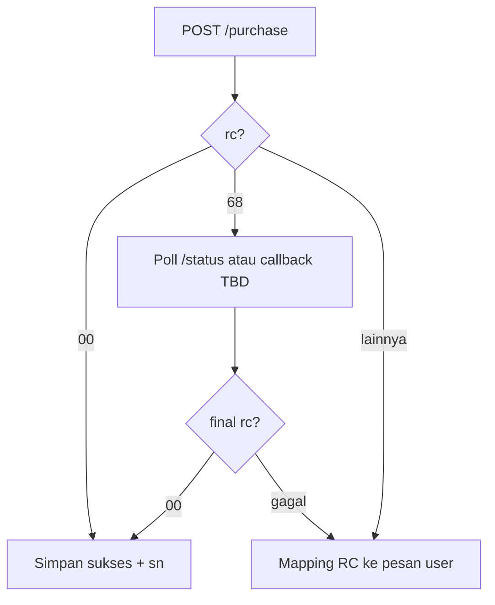

# Contoh respons — produk pulsa

Produk **pulsa** memakai `code` SKU pulsa (contoh dokumen: `HSA5`) dan `msisdn` = **nomor HP pelanggan** (hanya digit, biasanya dimulai `08...`).

## Request (JSON POST)

```http
POST /reseller/api/v1/purchase HTTP/1.1
Host: indotechapi.socx.app
Authorization: Bearer <JWT>
Content-Type: application/json

{
  "code": "HSA5",
  "msisdn": "08121231231",
  "request_id": "PULSA-20250322-0001"
}
```

## Skenario A — Pending (`rc = 68`)

Transaksi diterima; biller masih memproses.

```json
{
  "code": "HSA5",
  "msisdn": "08121231231",
  "request_id": "PULSA-20250322-0001",
  "rc": "68",
  "trxid": 16413,
  "price": 5400,
  "balance": 341890000,
  "sn": "",
  "message": "PENDING, Transaksi sedang diproses"
}
```

| Field | Nilai contoh | Interpretasi pulsa |
|-------|----------------|----------------------|
| `sn` | `""` | Belum ada serial; normal untuk pending |
| `price` | `5400` | Harga yang dikenakan untuk SKU ini |
| `message` | teks pending | Tampilkan status internal; jangan anggap sukses ke end-user |

**Langkah integrator:** panggil [`POST /status`](./cek-status.md) dengan `request_id` yang sama, atau tunggu notifikasi server-ke-server jika sudah disepakati (**TBD**).

## Skenario B — Sukses (`rc = 00`) — contoh spesifikasi

**Catatan:** Contoh di bawah menggambarkan bentuk respons yang **diharapkan** integrator; sesuaikan dengan respons real dari API setelah transaksi final (validasi dengan tim SOCX).

```json
{
  "code": "HSA5",
  "msisdn": "08121231231",
  "request_id": "PULSA-20250322-0001",
  "rc": "00",
  "trxid": 16413,
  "price": 5400,
  "balance": 341884600,
  "sn": "02123123123123123",
  "message": "SUKSES"
}
```

| Field | Interpretasi pulsa |
|-------|---------------------|
| `sn` | Bisa berisi referensi biller / token; tampilkan ke pelanggan jika relevan |
| `balance` | Saldo deposit Anda setelah transaksi |

## Skenario C — Gagal nomor tidak ditemukan (`rc = 07`)

```json
{
  "code": "HSA5",
  "msisdn": "08100000000",
  "request_id": "PULSA-20250322-0002",
  "rc": "07",
  "trxid": 0,
  "price": 0,
  "balance": 341890000,
  "sn": "",
  "message": "Nomor pelanggan tidak ditemukan"
}
```

**TBD:** Pastikan format pasti `message` dan apakah `trxid` selalu `0` untuk gagal — verifikasi di UAT.

## Skenario D — Saldo tidak cukup (`rc = 18`)

```json
{
  "code": "HSA5",
  "msisdn": "08121231231",
  "request_id": "PULSA-20250322-0003",
  "rc": "18",
  "trxid": 0,
  "price": 5400,
  "balance": 1000,
  "sn": "",
  "message": "Saldo deposit tidak cukup"
}
```

## Ringkasan decision tree (pulsa)



## Daftar kode produk pulsa

**TBD:** Daftar resmi `code` (per operator / denom) akan masuk halaman [Inquiry](../inquiry/README.md) setelah ada URL/kontrak dari tim SOCX. Untuk uji awal gunakan kode yang diberikan tim SOCX untuk sandbox.
