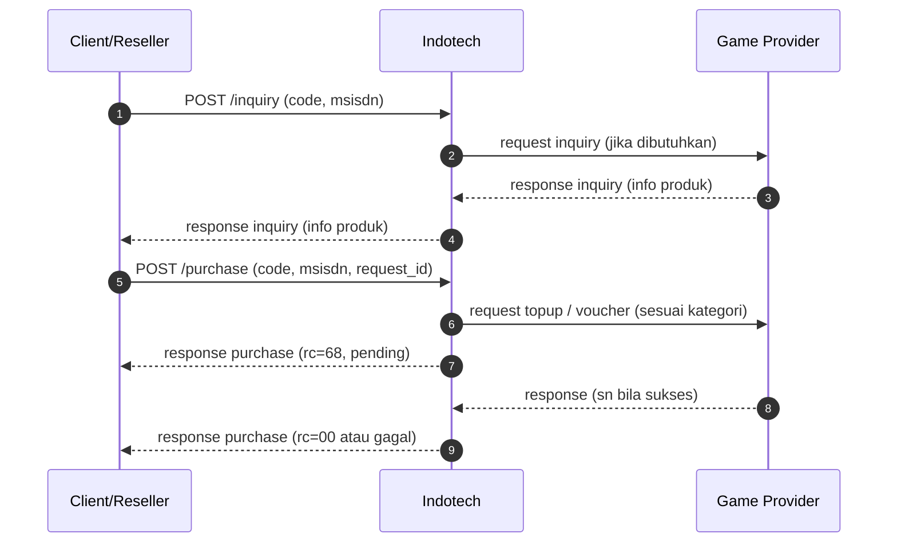

# Flow Inquiry & Purchase (umum)

Diagram berikut menggambarkan alur sampai transaksi final untuk integrasi game.

Request detail (payload) mengikuti kontrak SOCX/API untuk `code` game Anda.


/ End of Selection
```

## Catatan

- Jika respons `rc=68`, transaksi dianggap **pending**.
- Jika request purchase menggunakan `request_id` yang sama, maka SOCX akan mengembalikan data transaksi yang sudah ada sesuai data terakhir di sistem SOCX.

