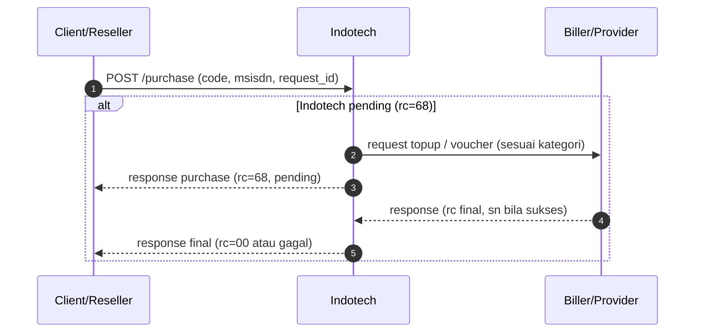

# Klasifikasi produk game

Halaman ini menjadi acuan parameter transaksi per `code`. **Klasifikasi tidak cukup satu sumbu “topup vs voucher”** — dipakai pemisahan: **Voucher** (produk kode digital), **Top-up tanpa zona**, dan **Top-up dengan zona**, lalu mapping ke field **`msisdn`** di API purchase.

Gunakan halaman ini sebagai acuan klasifikasi, request, dan respons produk game saat implementasi.

Di API **SOCX purchase**, parameter game biasanya dimapping ke satu field **`msisdn`** sesuai **aturan per `code`** (delimiter dan urutan dari tim SOCX/API).

## Direct Purchase (umum)

Diagram berikut menggambarkan alur sampai transaksi final. Request detail (payload) mengikuti kontrak SOCX/API untuk `code` game Anda.



## 1. TOPUP

#### &nbsp;&nbsp;&nbsp;&nbsp;Top-up — tanpa zona (non-zone)

&nbsp;&nbsp;&nbsp;&nbsp;&nbsp;&nbsp;Contoh: **Free Fire**, **Arena of Valor**, dll.

- Tujuan: isi saldo/item ke **akun game** memakai **ID pemain** (dan field tambahan jika diminta biller — selaraskan dengan katalog SOCX).
- **`msisdn`** memuat gabungan parameter akun game sesuai **tabel per `code`**, **bukan** pola voucher (nomor HP sebagai pengganti user ID).

#### &nbsp;&nbsp;&nbsp;&nbsp;Top-up — dengan zona

&nbsp;&nbsp;&nbsp;&nbsp;&nbsp;&nbsp;Contoh: **Mobile Legends**.

- Butuh **zone ID** bersama **user ID**.
- Klien mengirim **`user_id` + `zone_id`** dalam satu nilai **`msisdn`** (format sesuai kesepakatan), lalu SOCX memproses pemisahan nilainya di sisi backend.

> **Catatan:** SKU lain dapat meminta **server_id** (bukan hanya zone) — isi **tabel per `code`** setelah ada katalog resmi.


| Kategori | Contoh | Arti `msisdn` di purchase | `sn` saat sukses |
|----------|--------|---------------------------|------------------|
| **Top-up — tanpa zona** | FF, AoV, dll. | **User / game ID** (+ parameter lain jika perlu), bukan nomor HP sebagai identitas akun | Biasanya kosong atau referensi; ikuti katalog |
| **Top-up — dengan zona** | ML (Mobile Legends) | **User ID + zone / server ID** dalam format yang disepakati | Biasanya kosong atau referensi; ikuti katalog |


#### Ringkasan topup

- `msisdn` berisi identitas akun game (non-zone) atau gabungan `user_id + zone_id` (zona), sesuai format SKU.
- `sn` pada respons sukses (`rc=00`) umumnya berupa referensi/bukti transaksi (simpan untuk rekonsiliasi).

## Aturan umum field API

| Item | Aturan |
|------|--------|
| `kategori_produk` | `VOUCHER` \| `TOPUP_NON_ZONA` \| `TOPUP_ZONA` (sesuai baris di atas). |
| `msisdn` | Selalu field utama purchase; isinya **bergantung kategori** (HP untuk voucher; ID game / gabungan ID+zona untuk top-up). Untuk top-up zona, klien mengirim nilai gabungan dan SOCX memproses pemisahannya. |
| `request_id` | Wajib unik untuk tiap order baru. |
| `sn` | Untuk **Voucher**: **kode voucher**. Untuk **Top-up**: referensi. |

## Tabel per code TOPUP (isi operasional)

Baris di bawah diisi dari **katalog & uji nyata**. SKU baru ditambahkan seiring data resmi dari tim SOCX/API.

**Keterangan kolom:** `kategori` menunjukkan jenis produk. `format msisdn` menunjukkan format input di request. `payload` berisi field wajib (`code`, `msisdn`, `request_id`). Kolom `sn` menampilkan contoh nilai saat transaksi sukses (`rc=00`). Untuk alur pending (`rc=68`), lihat [Cek status](cek-status.md).

| code | nama | kategori | format `msisdn` | payload | contoh `msisdn` | `sn` (contoh sukses, `rc=00`) | status |
|------|------|----------|-----------------|---------|-----------------|-------------------------------|--------|
| `CFF5` | Free Fire 5 Diamond CORP | `TOPUP_NON_ZONA` | user ID | `code`, `msisdn`, `request_id` | `704899131` | `Free Fire 5 Diamonds /nickname : 死•ＩＲＦＡＮ•☠︎ refid: ab954b112f6c8aefbc6550167da150eb` | Terverifikasi |
| `CML5` | MLBB 5 Diamonds (5+0 Diamonds) Corporate | `TOPUP_ZONA` | gabungan user + zone | `code`, `msisdn`, `request_id` | `4189395759887` | `ZIYECH. . RefId: CS774320333ZGVLM0U8VI` | Terverifikasi |

## 2. VOUCHER

Voucher adalah kategori produk kode digital untuk redeem. Pada kategori ini:

- `msisdn` = nomor HP pelanggan (bukan user ID game)
- `sn` pada respons sukses final (`rc=00`) = kode voucher yang dikirim ke pemain untuk redeem

#### Tabel per code VOUCHER

| code | nama | kategori | format `msisdn` | payload | contoh `msisdn` | `sn` (kode voucher sukses, `rc=00`) | status |
|------|------|----------|-----------------|---------|-----------------|-----------------------------------------|--------|
| `GPC5` | Google Play Rp 5.000 INDONESIA REGION Corporate | `VOUCHER` | nomor HP | `code`, `msisdn`, `request_id` | `081386467468` | `03GCXLDRDPPNBBEL` | Terverifikasi |

## Contoh request & respons produk game

### Request (JSON POST)

#### 1) Voucher (`GPC5`)

```json
{
  "code": "GPC5",
  "msisdn": "081386467468",
  "request_id": "km17l40myg3z51097"
}
```

#### 2) Top-up non-zona (`CFF5`)

```json
{
  "code": "CFF5",
  "msisdn": "704899131",
  "request_id": "eg45e10xpxge57760"
}
```

#### 3) Top-up zona (`CML5`)

```json
{
  "code": "CML5",
  "msisdn": "4189395759887",
  "request_id": "b624qp05nhnh52066"
}
```

### Respons pending (`CML5`)

```json
{
  "code": "CML5",
  "msisdn": "4189395759887",
  "request_id": "b624qp05nhnh52066",
  "rc": "68",
  "trxid": 2505577,
  "price": 1440,
  "balance": 83844592,
  "message": "PENDING, Transaksi sedang diproses"
}
```

### Respons sukses (contoh real)

#### Voucher (`GPC5`)

```json
{
  "ref_id": "km17l40myg3z51097",
  "status": "1",
  "code": "GPC5",
  "hp": "081386467468",
  "price": "4900",
  "message": "Success",
  "balance": "59412105",
  "tr_id": "2209728",
  "rc": "00",
  "sn": "03GCXLDRDPPNBBEL"
}
```

#### Top-up zona (`CML5`)

```json
{
  "data": {
    "ref_id": "b624qp05nhnh52066",
    "status": "1",
    "code": "CML5",
    "hp": "4189395759887",
    "price": "1440",
    "message": "Success",
    "balance": "83844592",
    "tr_id": "2505577",
    "rc": "00",
    "sn": "ZIYECH. . RefId: CS774320333ZGVLM0U8VI"
  }
}
```

#### Top-up non-zona (`CFF5`)

```json
{
  "data": {
    "ref_id": "eg45e10xpxge57760",
    "status": "1",
    "code": "CFF5",
    "hp": "704899131",
    "price": "900",
    "message": "Success",
    "balance": "47269920",
    "tr_id": "2434954",
    "rc": "00",
    "sn": "Free Fire 5 Diamonds /nickname : 死•ＩＲＦＡＮ•☠︎ refid: ab954b112f6c8aefbc6550167da150eb"
  }
}
```

## Panduan pengisian cepat

1. **Tentukan kategori** — Voucher, top-up tanpa zona, atau top-up dengan zona (bukan sekadar “topup atau voucher” saja).
2. **Untuk voucher** — pastikan **`msisdn`** = **nomor HP**; **`sn`** = kode redeem.
3. **Untuk top-up** — susun **`user_id`** dan **`zone_id` / `server_id`** jika perlu; mapping ke **`msisdn`** mengikuti ketentuan SOCX.
4. **Validasi reply** — simpan contoh `rc=00` dan `rc=68` per SKU.

## Catatan untuk tim integrasi

- **Voucher** dan **top-up game** adalah **alur bisnis berbeda**; jangan menyamakan `msisdn` voucher (nomor HP) dengan `msisdn` top-up (ID game).
- Jadikan **tabel per `code`** sebagai acuan handover agar tidak salah interpretasi parameter.
